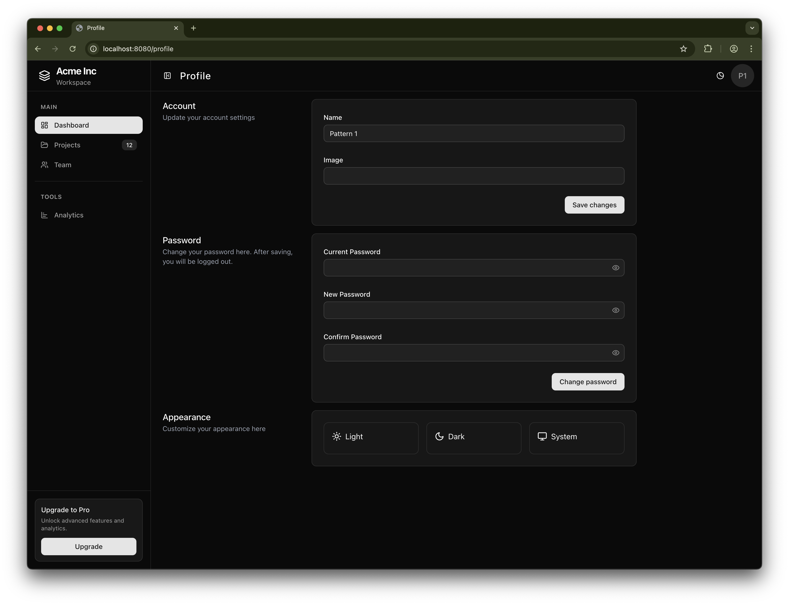

# Go Web Starter

Production-ready starter using Go, Templ, HTMX, TailwindCSS, SQLC, Goose, and PostgreSQL.

## Live Demo

Visit the live demo: [go-web-starter.fly.dev](https://go-web-starter.fly.dev/)



## Getting Started

### Included
- TemplUI
- Templ
- HTMX
- PostgreSQL or SQLite
- TailwindCss
- Docker
- Sqlc
- Goose

## MakeFile

Apply migrations to the database
```bash
make migrate
# or
go run cmd/api/main.go migrate
```

Run build make command with tests
```bash
make all
```

Build the application
```bash
make build
```

Run the application
```bash
make run
```

Live reload the application:

```bash
make watch
```

Mailhog test mail server
- Install mailhog for your OS
- localhost:8025
```bash
mailhog
```

Run the test suite:
```bash
make test
```

Clean up binary from the last build:
```bash
make clean
```

## Contributing

Contributions are welcome! If you have ideas, bug fixes, or improvements:

1. Fork the repository
2. Create a feature branch
3. Commit your changes with clear messages
4. Open a pull request describing your changes and rationale

Please keep changes focused and aligned with the project’s scope. Thank you for helping improve Go Web Starter!
